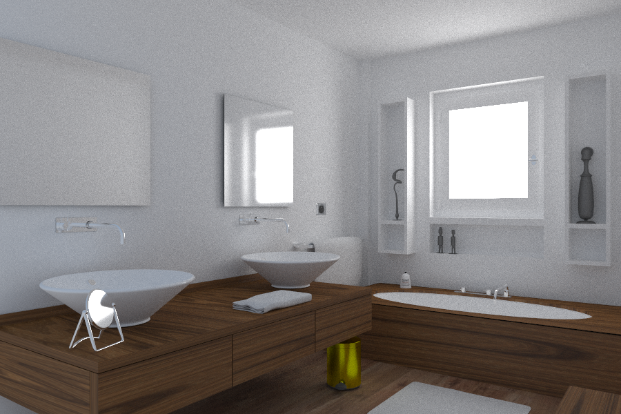

# Ray Tracing - What GPU Solves and Doesn't Solve

As I quited NVIDIA recently, now I have more freedom of talking about not just the positive sides of GPUs.

## Which Ray-Tracing?

When it comes to ray-tracing, a fact I have to admit is that NVIDIA's RTX ray-tracing acceleration circuit is one the most significant add-ons to its GPU production line in the recent years. However, there are 2 concepts getting us confused quite often, which are:

* The ray-tracing procedrue, which is essential for the generation of physically correct, photorealistic pictures.
* The ray-tracing acceleration capability provided by Geforce RTX GPUs.

While the latter addresses some of the core concerns of the former, it is wrong to consider them as equal, or calling Geforce RTX a foundamental solution to the difficulties of the ray-tracing procedure. 

The ray-tracing procedure, on one hand, is in fact a Monte Carlo approximation of the "rendering equation", which is a 2D integration of in-coming radiance over the hemisphere defined by the normal vector. The integration needs to be estimated recursively for all the surface points where the transmitted radiance contributes to the final result directly or indirectly. The detail of the "rendering equation" can be found in all university courses related to this subject, such as [the standford course](http://graphics.stanford.edu/courses/cs348b-01/readings.html).

Geforce RTX, on the other hand, provides some novel circuits that accelerates the following 2 tasks:

* Computing the intersection point (if there is) between a light ray and a triangle in space
* Traversal of an acceleration structure(AS), or, locating a small subset of triangles that can potentially intersect with a light ray.

An important fact is that these tasks, as they are well defined, are always possible to do. And, believe it or not, they are not difficult at all. As a veteran in graphics, I have the experience of writing them for both CPU and GPU(CUDA). The only part I can call it "tricky" is the construction of an AS. That happens before the rendering and doesn't make use of the new circuit by now. Although there are indeed readily available APIs to do the work, they are actually just some encapsulated compute shaders or CUDA kernels.

With RTX, we still need to perform the exact number of ray-AS intersection tests. The difference is that we are a little bit faster for each test. This is what a GPU has always been doing: doing the work in parallel and making each unit of the work less expensive. For parallelization, there are SMs. For accelerating basic operations, there were the rasterizer, the tensor-cores, now comes "ray-tracing".

The rasterizer has long been at the center of graphics. By comparing ray-tracing with rasterization, we can see better how the new feature makes a difference.

## Rasterization - accelerating a subset of rays

The above picture shows that a rasterizer can also be seen as an accelerator of massive rays, only that the rays must be aligned in some fixed pattern. They must either be starting from the same point or be parallel to each other. These are actually the 2 important ways how rays can be bunched together, because they form 2 kinds of 3D->2D projections: perspective projection and parallel projection. Because of the special layout of rays, it is easier to do the calculation in object order, which is the actual way that a rasterizer works. Over the years as computer graphics develops, rasterizer, the hardware unit specialized for projections has proved to be so useful that almost all graphics applications are built around it.

The new "ray-tracing" unit can be seen as lifting the restrictions on how the rays are bunched together. Now, the estimation of massive rays that are not related to each other by either the starting point or the shooting direction, is also hardware accelerated! Just enabling us shooting rays from different positions can be useful. We know that a camera receives light through its aperture. As a result, only the objects near the focus distance are focused clearly, objects that are too far or too near are defocused. To physically simulate that, what we need to do is to shoot ray from a disk area instead of a single point.

## How to Utilize

A straightforward utilization of the new "ray-tracing" unit is to use it to build a faster Monte Carol path-tracer. NVIDIA has already did that in its OptiX project. However, this doesn't immediately make Monte Carol path-tracing realtime. This is because of the fact that the new unit only accelerates the unit work, without reducing the foundamental complexity of the problem. [FeiRays](https://github.com/fynv/FeiRays) is another attampt to do that. The difference is that FeiRays is based on Vulkan, as is fully opensource. Currently, using DirectX 12 or Vulkan are the only ways for anyone outside NVIDIA to program the new unit at low-level. OptiX is built using some CUDA intrinsics that are only available inside NVIDIA. By using Vulkan, FeiRays uses the same hardware units as OptiX, but is a little less efficient because of API overheads and compiler optimizations.

The "salle_de_bain" model rendered with FeiRays (900x600x1000 rays in 20 seconds).

For games and other realtime applications, some more feasible utilizations of the hardware unit are non-recursive usages, such as reflections and shadow calculation. 

The fact that the rays we are estimating in parallel do not need to relate to each other can result in some more interesting usages. One of them is for realtime global illumination - [DDGI](https://devblogs.nvidia.com/rtx-global-illumination-part-i/). DDGI is an upgrade to probe-based global illumination. With ray-tracing, irradiance map of the probes can be updated much efficiently by shooting rays from the center of each probe. Using a temporal averaging scheme, the rendering result can approximate an infinite number of bounces.

