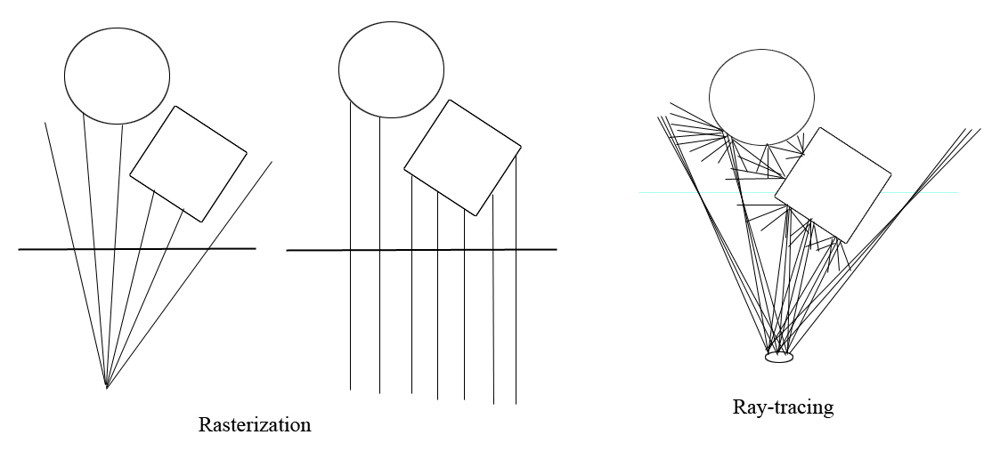

# Ray Tracing - What GPU Solves and Doesn't Solve

As I quited NVIDIA recently, now I have more freedom of talking about not just the positive sides of GPUs.

## Which Ray-Tracing?

When it comes to ray-tracing, a fact I have to admit is that NVIDIA's RTX ray-tracing acceleration circuit is one the most significant add-ons to its GPU production line in the recent years. However, there are 2 concepts getting us confused quite often, which are:

* The ray-tracing procedrue, which is essential for the generation of physically correct, photorealistic pictures.
* The ray-tracing acceleration capability provided by Geforce RTX GPUs.

While the latter addresses some of the core concerns of the former, it is wrong to consider them as equal, or calling Geforce RTX a foundamental solution to the difficulties of the ray-tracing procedure. 

The ray-tracing procedure, on one hand, is in fact a Monte Carlo approximation of the "rendering equation", which is a 2D integration of in-coming radiance over the hemisphere defined by the normal vector. The integration needs to be estimated recursively for all the surface points where the transmitted radiance contributes to the final result directly or indirectly. The detail of the "rendering equation" can be found in all university courses related to this subject, such as [the standford course](http://graphics.stanford.edu/courses/cs348b-01/readings.html).

Geforce RTX, on the other hand, provides some novel circuits that accelerates the following 2 tasks:

* Computing the intersection point (if there is) between a light ray and a triangle in space
* Traversal of an acceleration structure(AS), or, locating a small subset of triangles that can potentially intersect with a light ray.

An important fact is that these tasks, as they are well defined, are always possible to do. And, believe it or not, they are not difficult at all. As a veteran in graphics, I have the experience of writing them for both CPU and GPU(CUDA). The only part I can call it "tricky" is the construction of an AS. That happens before the rendering and doesn't make use of the new circuit by now. Although there are indeed readily available APIs to do the work, they are actually just some encapsulated compute shaders or CUDA kernels.

With RTX, we still need to perform the exact number of ray-AS intersection tests. The difference is that we are a little bit faster for each test. This is what a GPU has always been doing: doing the work in parallel and making each unit of the work less expensive. For parallelization, there are SMs. For accelerating basic operations, there were the rasterizer, the tensor-cores, now comes "ray-tracing".

The rasterizer has long been at the center of graphics. By comparing ray-tracing with rasterization, we can see better how the new feature makes a difference.

## Rasterization - accelerating a subset of rays

